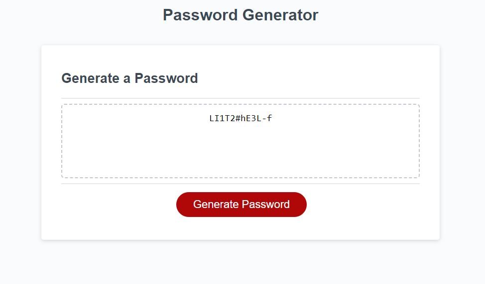

# Password Generator

## Description
The Password Generator project allow the user to generate a password with the chosen length.It also includes the feature of allowing user to add in uppercase, lowercase, numbers and special character into the password.

### Motivation
- wanting to improve the skills for JS coding
- preparation potential future jobs

### Purpose of the project
- Understanding basic function of th JavaScript 
- set the foundation for future projects
- Serve as an reference to the future 

### Resolutions
- Might come in handy down the line if someday I'm too lazy to think about the password
- Answer some of the potential question I might have JavaScript

### Learning Outcome
- Better understanding the functions of different key terms
- Understanding how to write a basic functional application 

## Credits

### Guidance  
- Class Instructor: Emmanuel
- Tutor: Jude

## Project Display

### Link
https://jackw2023.github.io/Password-Generator/
